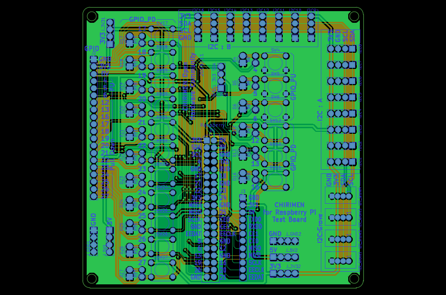

# CHIRIMEN for RPi Full Test Board

CHIRIMEN for Raspberry Piの、[テストスイート](https://github.com/chirimen-oh/chirimen-raspi3/tree/master/gc/testSet)を一気に通すための試験用基板です。

## Size

100x100mm  2layers

## Version

0.5 (KiCad version:5.1.4)

## Parts

この基板に以下のパーツを半田付けしてご利用ください

- Raspberry Pi 接続用
  - 2x20 ピンソケット x1 - [秋月電子](http://akizukidenshi.com/catalog/g/gC-00085/)
    - あるいは 2x20 連結ピンソケット x1 - [秋月電子](http://akizukidenshi.com/catalog/g/gC-02485/), [スイッチサイエンス](https://www.switch-science.com/catalog/2022/)
    - あるいは 2x20 スタッキングコネクタ x 1 - [秋月電子](http://akizukidenshi.com/catalog/g/gC-10702/)
- GPIO 試験用
  - LED x 17
  - LED 用抵抗 470Ω x 17
  - タクトスイッチ (4本足、黒) x 14 - [秋月電子](http://akizukidenshi.com/catalog/g/gP-03647/), [Amazon](https://www.amazon.co.jp/dp/B07SYHP9B4/), [AliExpress](https://ja.aliexpress.com/item/32845984040.html)
  - タクトスイッチ (4本足、白) x 3 - [秋月電子](http://akizukidenshi.com/catalog/g/gP-03648/), [Amazon](https://www.amazon.co.jp/dp/B07SYZCL8Q/), [AliExpress](https://ja.aliexpress.com/item/32847703781.html)
- Grove 接続用
  - メスソケット x 4 - [Switch Science](https://www.switch-science.com/catalog/1122/)
- I2C その他の接続用
  - 1x20 ピンヘッダ x 1 - [秋月電子 (1x40 を分割)](http://akizukidenshi.com/catalog/g/gC-00167/)
    - あるいは 1x20 ピンソケット x1 - [秋月電子](http://akizukidenshi.com/catalog/g/gC-03077/)
  - 1x12 ピンヘッダ x 1 - [秋月電子 (1x40 を分割)](http://akizukidenshi.com/catalog/g/gC-00167/) 
    - あるいは 1x12 ピンソケット x1 - [秋月電子](http://akizukidenshi.com/catalog/g/gC-10101/)
  - 1x4 ピンヘッダ x 6 - [秋月電子 (1x40 を分割)](http://akizukidenshi.com/catalog/g/gC-00167/) 
  - 1x4 ピンソケット x 16 (I2C 用) - [秋月電子](http://akizukidenshi.com/catalog/g/gC-10099/)
    - note: 分割ロングピンソケットを分割してもよいが見栄えは悪くなる - [秋月電子](http://akizukidenshi.com/catalog/goods/search.aspx?search=x&keyword=fhu-1)

I2C デバイス接続用に用意しておくと便利なもの
- 4pin ジャンパワイヤ - [秋月電子](https://ja.aliexpress.com/item/32812824461.html)

そのほか、試験対象とする I2C デバイス一式をご用意ください

## License

CC by 4.0
