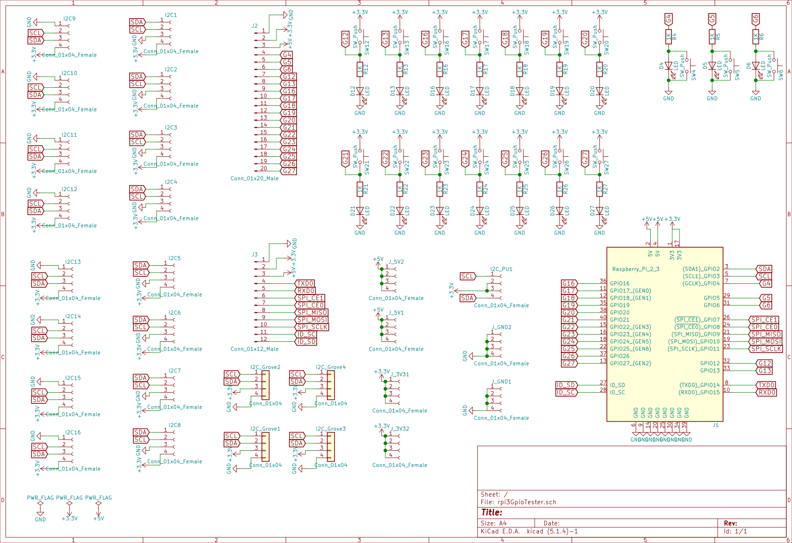

# CHIRIMEN for RPi Full Test Board

CHIRIMEN for Raspberry Piの、[テストスイート](https://github.com/chirimen-oh/chirimen-raspi3/tree/master/gc/testSet)を一気に通すための試験用基板です。

それ以外にもRaspberry Piのブレークアウトボード的に便利に使えるかもしれません。

## Size

100x100mm  2layers

## Version

0.5 (KiCad version:5.1.4)

## 基板の発注

Elecrow等の基板製造サービスに、基板のサイズ(100x100mm)、Layer数(=2)、厚みや色(お好みで)など必要事項を記載の上、Gerberディレクトリの内容をアーカイブしたものを添付して発注します。[詳細は、Webで検索](https://www.google.com/search?q=elecrow+%E7%99%BA%E6%B3%A8%E6%96%B9%E6%B3%95)

## Parts

この基板に以下のパーツを半田付けしてご利用ください

- Raspberry Pi 接続用
  - 2x20 ピンソケット x1 - [秋月電子](http://akizukidenshi.com/catalog/g/gC-00085/)
    - あるいは 2x20 連結ピンソケット x1 - [秋月電子](http://akizukidenshi.com/catalog/g/gC-02485/), [スイッチサイエンス](https://www.switch-science.com/catalog/2022/)
    - あるいは 2x20 スタッキングコネクタ x 1 - [秋月電子](http://akizukidenshi.com/catalog/g/gC-10702/)
- GPIO 試験用
  - LED x 17 (3mm砲弾型で設計)
  - LED 用抵抗 470Ω x 17 (LEDに流したい電流によって調整してください(1KΩぐらいまでは光ると思います))
  - タクトスイッチ (4本足、黒) x 14 - [秋月電子](http://akizukidenshi.com/catalog/g/gP-03647/), [Amazon](https://www.amazon.co.jp/dp/B07SYHP9B4/), [AliExpress](https://ja.aliexpress.com/item/32845984040.html)
  - タクトスイッチ (4本足、白) x 3 - [秋月電子](http://akizukidenshi.com/catalog/g/gP-03648/), [Amazon](https://www.amazon.co.jp/dp/B07SYZCL8Q/), [AliExpress](https://ja.aliexpress.com/item/32847703781.html)
- Grove 接続用
  - メスソケット x 4 - [千石通商](https://www.sengoku.co.jp/mod/sgk_cart/detail.php?code=EEHD-4KKK), [Switch Science](https://www.switch-science.com/catalog/1122/)
- I2C 接続用
  - 1x4 ピンソケット x 16 (I2C 用) - [秋月電子](http://akizukidenshi.com/catalog/g/gC-10099/)
    - note: 分割ロングピンソケットを分割してもよいが見栄えは悪くなる - [秋月電子](http://akizukidenshi.com/catalog/goods/search.aspx?search=x&keyword=fhu-1)
- その他の接続用
  - 1x20 ピンヘッダ x 1 - [秋月電子 (1x40 を分割)](http://akizukidenshi.com/catalog/g/gC-00167/)
    - あるいは 1x20 ピンソケット x1 - [秋月電子](http://akizukidenshi.com/catalog/g/gC-03077/)
  - 1x12 ピンヘッダ x 1 - [秋月電子 (1x40 を分割)](http://akizukidenshi.com/catalog/g/gC-00167/) 
    - あるいは 1x12 ピンソケット x1 - [秋月電子](http://akizukidenshi.com/catalog/g/gC-10101/)
  - 1x4 ピンヘッダ x 6 - [秋月電子 (1x40 を分割)](http://akizukidenshi.com/catalog/g/gC-00167/) 

I2C デバイス接続用に用意しておくと便利なもの
- 4pin ジャンパワイヤ - [秋月電子](https://ja.aliexpress.com/item/32812824461.html)

そのほか、試験対象とする I2C デバイス一式をご用意ください

## PCB Assembly

### 極性に注意するパーツ

- LED : 基板のパターンで、□(四角いランド)がGND(-)です (LEDの短い足を挿す)
- Grove : 写真を参考に
- 2x20ピンソケット : 裏側に取り付けます

### その他のはんだ付けの留意点

コネクタやピンヘッダは、まずピン一本だけはんだ付けした後、浮き上がりや、傾きなどをコテを当てながら修正した後に、残りの全ピンをはんだ付けするときれいに仕上がります。LEDやタクトスイッチ、抵抗器も同様に処理すると良いでしょう。

Grove や I2C 接続用ソケットはまとめてマスキングテープや養生テープで固定してから半田付けを行うとまとめて半田付けし易いです。

I2C, GND, 5V, 3.3V などをピンヘッダとピンソケットのいずれにするかは好み次第ですが、予定と違うものを付けないよう注意しましょう。

GPIO のプルアップ (PU) とプルダウン (PD) はお好み (と手元のパーツの都合) で LED やタクトスイッチの色を変えると見やすくなります。

### 組み立て例

## 回路図

## License

CC by 4.0

## OSHWA (オープンソースハードウェア) 認証ID
https://certification.oshwa.org/jp000006.html
