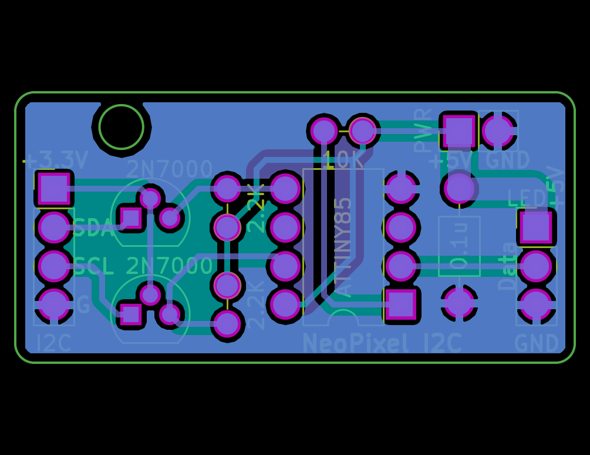

This is a KiCad data and Gerber data and Fritzing illustration for making a neopixel_i2c board only with through hole parts.

neopixel_i2c is a intelligent driver for easy controlling Nopixel LEDs by Raspberry Pi etc via I2C. Ofcourse by [CHIRIMEN webI2C](https://chirimen.org/chirimen-raspi3/gc/top/examples/#advanced)!

* Original firmware : https://github.com/usedbytes/neopixel_i2c
* Issue fixed firmware: https://github.com/satakagi/neopixel_i2c

